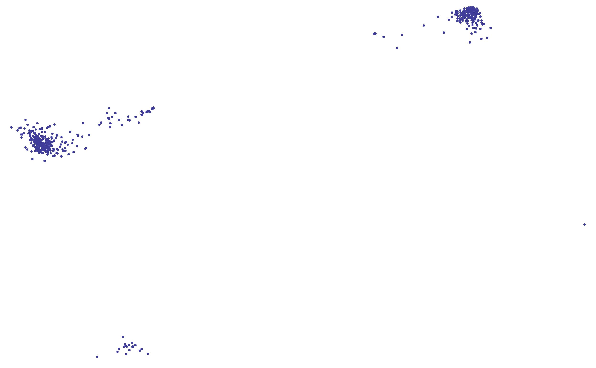

# smartvoteFR
création de "smartmaps" politiques sur le modèle de smartvote.ch avec données de l'Assemble Nationale Française

voir https://www.drgoulu.com/2017/05/14/la-politique-francaise-dans-la-deuxieme-dimension/

sur une idée d'Antoine Bourget ( http://disq.us/p/1iwu9xg )

source des données:
* http://data.assemblee-nationale.fr/acteurs/deputes-en-exercice
* http://data.assemblee-nationale.fr/travaux-parlementaires/votes

##Etat actuel

 scrutins.py produit la table votes.csv avec:
* une ligne par vote à l'assemblée nationale depuis jeuillet 2012 à novembre 2016
* une colonne par député
* dans chaque cellule, s'il a voté pour (1), contre (-1), ou s'est abstenu (0)
la cellule est vide si le député n'a pas voté

La table est également disponible sous https://docs.google.com/spreadsheets/d/1QrRwcyI93AxPS7Dog40C62sfJDMTyERFPAd4FK7SC9E/edit?usp=sharing 

Premier calcul et visualisation par Antoine Bourget:
* Les cellules vides de la table (pas voté)  sont remplies par des 0 (= abstention)
* Le code Mathematica AnalyseVotes.nb utilise la fonction http://reference.wolfram.com/language/ref/Eigensystem.html
* ce qui produit le résultat actuel :

##A faire

[ ] orienter "gauche/droite" correctement : 
comme le le gouvernement était socialiste pendant la période considérée,
il est probable que les voix "pour" (=1) la plupart des textes votés
corresponde à la "gauche" alors que les voix "contre" (-1) indiquent la droite
[ ] indiquer les valeurs propres des 3 premiers axes
[ ]indiquer le nom des députés
[ ]colorier les points par groupe (=parti)

Toute aide est bienvenue !
  
